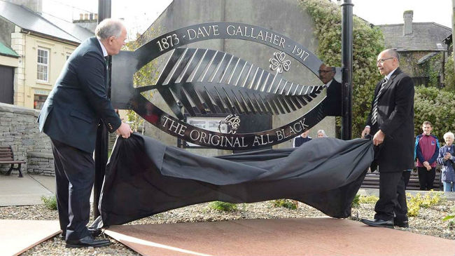
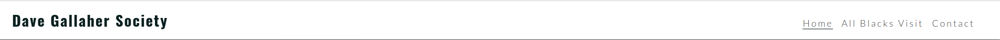
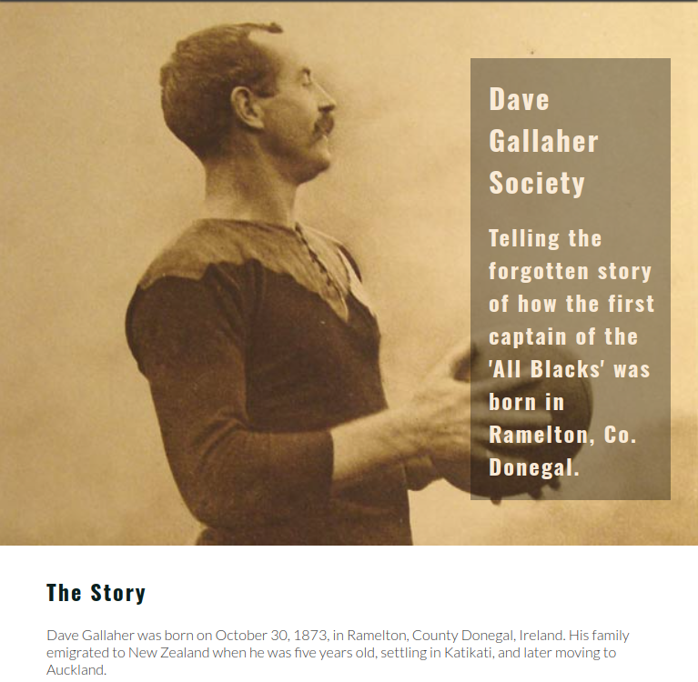
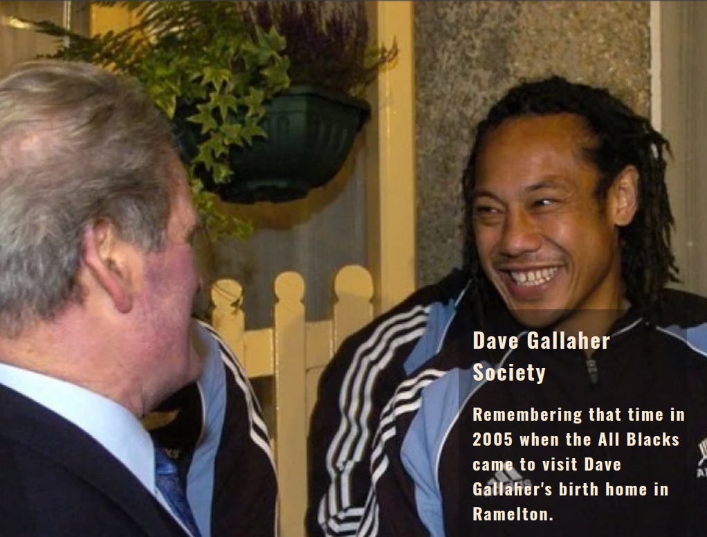
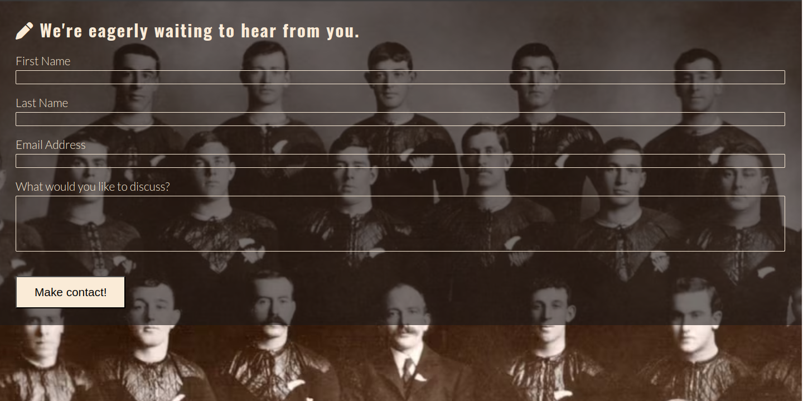
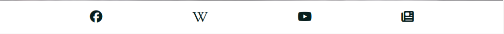

# Dave Gallaher Society

## Intro

Dave Gallaher is a very important part of the history of Ramelton.  Although Dave did not reside in Ramelton for too many years before he and his family emigrated to New Zealand, the fact that the first captain of the New Zealand rubgy team, known as 'The Originals' was born in a small Donegal town should not be underestimated. The Dave Gallaher Society wishes to protect this legacy and in so doing, promote Ramelton as a place to visit for rubgy and sports fans alike.  The Dave Gallaher Society has an online presence in the form of an official Facebook page but it is hoped that a regularly updated and well maintained website might be a good starting point for anyone interested in learning more about this story.

  

## Features

### Existing Features

- **Navigation Bar**
  - The navigation bar is available on all three pages of the site, so that navigating between the different pages is made easy no matter what page the user is currently on. Using the same navigation bar on each page ensures that how a user navigates is consistent across all three pages.

    

- **Home Page**
  - The home page provides some background information on Dave Gallaher and also features a hero image of Dave Gallaher.

    

- **All Blacks Visit Page**
  - This page outlines the story of the time some members of the All Blacks team visited Ramelton and Letterkenny to honour Dave Gallaher.

    

- **Make Contact Page**
  - This page allows users to get in contact with the Dave Gallaher Society if they have any stories to share.

    

- **Footer**
  - The footer allows users to navigate to various different resources relevant to Dave Gallaher, such as the official Facebook page, a YouTube video telling the story of Dave Gallaher, Wikipedia's entry on Dave Gallaher and an RTE article on Dave Gallaher.

    

#### Button/Links
  All buttons and links from within the Footer navigate the user to a newly opened tab featuring the relevent content.

### Features Left to Implement
  It is expected that the site will have numerous improvements made in the future but the next feature that is expected to be added is a photo gallery page so that user provided photos can be shared the wider community.

## Manual Testing

- The site was tested extensively using Chrome devtools to confirm that all pages look and behave as expected across all device sizes.
- All links in the footer were tested to confirm that each will open a new browser tab and bring the user to the intended destination site.

### Validator Testing
  - **HTML**
    - No errors were found using the official W3C validator
  - **CSS**
    - No errors were found using the the official (Jigsaw) validator

## Deployment

- The site was deployed to GitHub pages. The steps to deploy are as follows:
  - In the GitHub repository, navigate to the Settings tab
  - From the source section drop-down menu, select the Master Branch
  - Once the master branch has been selected, the page will be automatically refreshed with a detailed ribbon display to indicate the successful deployment.

The live link can be found here - https://cmcdgit.github.io/dave-gallaher-society-site/index.html

## Credits

### Content

- The text for the Home page was generated using [ChatGPT](https://chatgpt.com/) and then successfully passed a test for plagiarism
- The text for the All Blacks Visit page was generated using [ChatGPT](https://chatgpt.com/) and also successfully passed a test for plagiarism
- The favicon icon in the tab/title bar was taken from [The Noun Project](https://thenounproject.com/browse/icons/term/rugby-ball/)
- The icons in the footer were taken from [Font Awesome](https://fontawesome.com/)

### Media

- The imag from the Dave Gallaher park at the top of this ReadMe is from the Dave Gallaher Society Facebook page
- The hero image on the home page is from [The Irish Times](https://www.irishtimes.com/sport/rugby/international/in-1905-the-first-all-blacks-had-achieved-perfection-1.3696648)
- The photo used on the visit page is from [Balls.ie](https://www.balls.ie/rugby/new-zealand-rugby-donegal-490763)
- The team image on the make contact page is from [The Irish Times](https://www.irishtimes.com/sport/rugby/international/in-1905-the-first-all-blacks-had-achieved-perfection-1.3696648)

